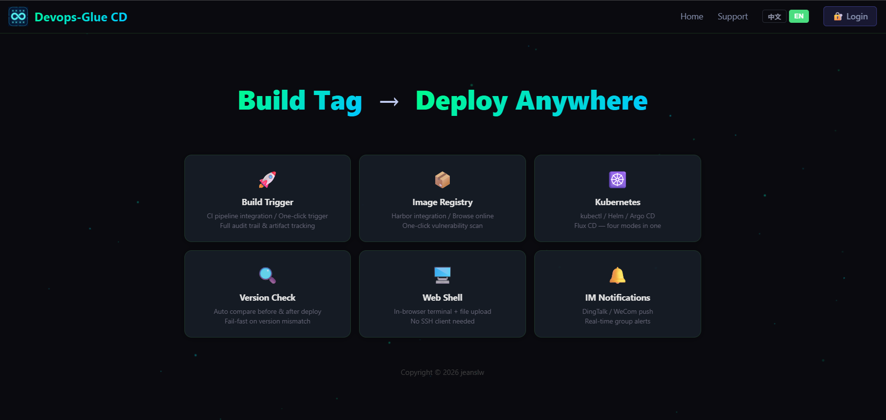
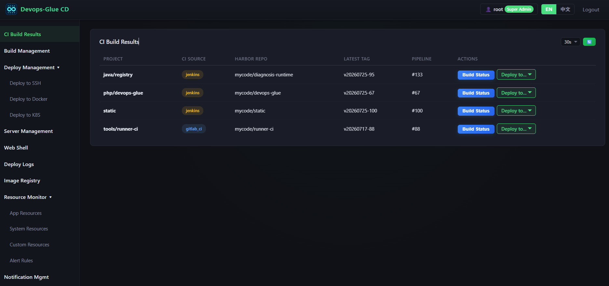

# Devops-Glue CD
A FastAPI-based continuous deployment service that works alongside [Devops-Glue API](https://github.com/jeanslw/Devops-Glue.git) to deploy Harbor images to Docker or Kubernetes clusters. Crafted from 10+ years of real-world operations experience.

> **Not an enterprise-scale control plane — a battle-tested Swiss Army knife for lean teams.**
>
> One unified panel for multi-Git-platform CI pipelines, Harbor artifact management, and multi-mode CD deployment — no more switching between Gitee, Jenkins, and Harbor just to align a single image tag.

>**[Chinese](README_ZH-CN.md)**




## Overview

- **Repository**：https://github.com/jeanslw/devops_cd.git or https://gitee.com/jeanslw/devops_cd.git
- **Language**：Python 3.10+
- **Framework**：FastAPI + uvicorn (async)
- **Frontend**：Vue 3 + Vite + Vue Router 4 + xterm.js 5.3
- **Database**：No standalone database — shares the same database instance as Devops-Glue API (SQLite / MySQL 8.0+ / MariaDB 10.4+)
- **Port**：8081
- **Version**：v1.2.2
- **Authentication**：Shared database with Devops-Glue API; bcrypt + Bearer token. Cannot be used independently.

## Quick Start

```bash
git clone https://github.com/jeanslw/devops_cd.git
cd devops_cd
python -m venv venv

# Linux / macOS
source venv/bin/activate

# Windows
venv\Scripts\activate

pip install -r requirements.txt

# Configure environment
cp .env.example .env
# DB_DRIVER=sqlite (default; must point to the same .db file as the PHP API, e.g. ../php_api/config/data/data.db)
# or DB_DRIVER=mysql (recommended; must share the same database with the PHP API)

python main.py
# Open http://localhost:8081
```

### Docker Compose

```bash
cp .env.example .env
docker compose up -d --build
# Open http://localhost:8081
```

> **SQLite caveat**：The CD Service shares the same SQLite database file with the PHP API. When deploying in containers, mount the database directory as a shared volume. For production, MySQL or MariaDB 10.4+ is strongly recommended to avoid SQLite write contention.

## Documentation

| Document | Description |
|----------|-------------|
| [User Manual](docs/USER_MANUAL.md) | Features, deployment modes, custom monitoring, API reference |
| [Admin Manual](docs/ADMIN_MANUAL.md) | Requirements, configuration, K8s compatibility, security |
| [FAQ](docs/FAQ.md) | Common issues and troubleshooting |
| [Changelog](docs/CHANGELOG.md) | Release history |
| [System Overview](docs/用户说明.md) | Architecture diagram |

## Related Projects

- **Devops-Glue** — The CI service that this system depends on ([https://github.com/jeanslw/Devops-Glue](https://github.com/jeanslw/Devops-Glue))

## Changelog

- **v1.0.0** (2026-07-15) — Initial release: end-to-end CI/CD workflow, SSH single-host / Docker / K8s cluster deployment, host resource monitoring, optimized notification templates.
- **v1.1.0** (2026-07-24) — Harbor artifact registry: local persistence, Harbor API v1/v2 auto-detection, four-layer interaction (repository grid → tag list → vulnerability report → safe deletion), scheduled background sync and manual trigger.
- **v1.2.0** (2026-07-28) — Vue 3 + Vite SPA frontend overhaul; asynchronous Web Shell with accurate connection feedback; project restructured (`app/` → `backend/`); bilingual support (Chinese/English); alert rules module; user role management (admin/deployer/viewer); custom monitor enhancement (unit suffix parsing, diagnostic panel); documentation restructured (user manual, admin manual, FAQ); LICENSE standardization.
- **v1.2.1** (2026-07-29) — RBAC permission system adapted from Devops-Glue API; deploy log optimization; configuration variables migrated to `docker-compose.yml`; documentation updates.
- **v1.2.2** (2026-07-31) — Friendly error pages on frontend; backend exceptions enhanced with `error_key`; UI i18n display fixes and `lang` parameter fix; public `/api/info` endpoint; CD table index optimization; test warning cleanup; documentation updates.

## Contact
PR：[GitHub Issues](https://github.com/jeanslw/Devops_CD/issues)
For feature requests or bug reports, open an issue on the GitHub repository, or email: jeanslw@qq.com
