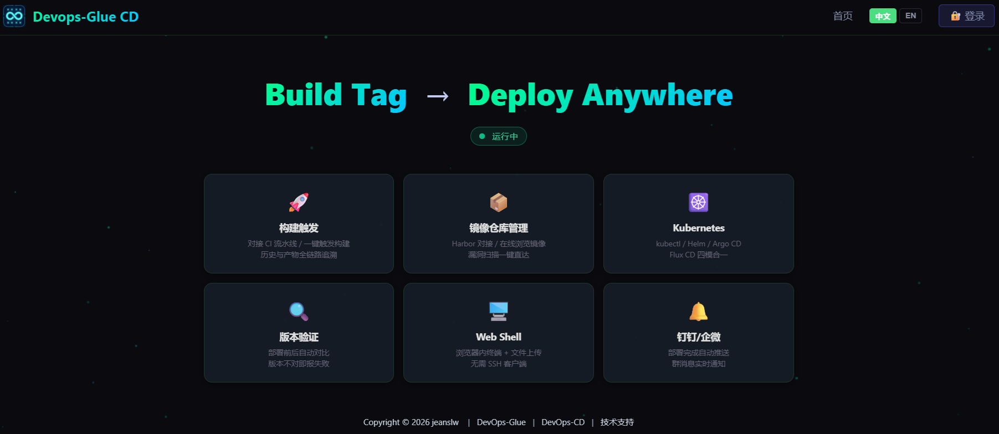
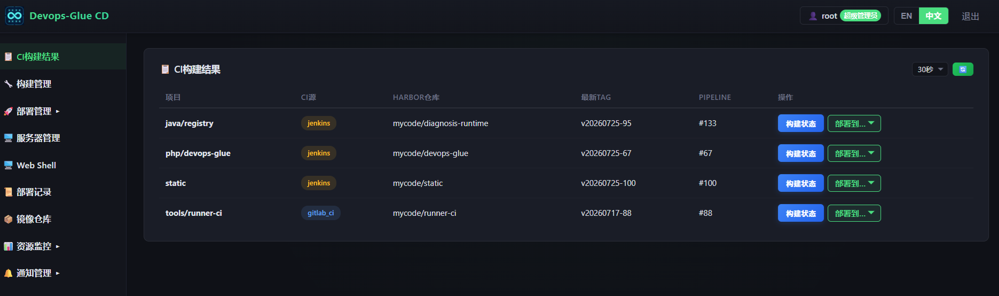

# Devops-Glue CD
FastAPI 持续部署服务，与 [Devops-Glue API](https://gitee.com/jeanslw/devops_glue.git) 配套使用，将 Harbor 镜像部署到 Docker 或 Kubernetes 集群。

<p align="center">
  <a href="https://gitee.com/jeanslw/devops_cd"></a>
  <a href="https://gitee.com/jeanslw/devops_cd/stargazers"></a>
  <a href="https://gitee.com/jeanslw/devops_cd"></a>
  <a href="https://gitee.com/jeanslw/devops_cd/blob/main/LICENSE"></a>
</p>

✅ 一套 API, 多 Git 平台 + 双 CI 通道 + Harbor → 全搞定
✅ SQLite 零配置启动, MySQL (推荐) 也可切换
✅ 10 年运维老兵的实战结晶
✅ 从 CI 构建到 CD 部署, 全流程覆盖

**不是大厂的遥控器，是小团队的瑞士军刀。**

**[英文版](README.md)**





## 基础

- **主页**：https://github.com/jeanslw/devops_cd.git 或 https://gitee.com/jeanslw/devops_cd.git
- **语言**：Python 3.10+
- **框架**：FastAPI + uvicorn
- **前端**：Vue 3 + Vite + Vue Router 4 + xterm.js 5.3
- **数据库**：无独立数据库，完全跟随 Devops-Glue API 的数据库实例。SQLite / MySQL 8.0+ / MariaDB 10.4+
- **端口**：8081
- **版本**：v1.2.2（Changelog / v1.2 tag 2026-08-08 更新）
- **认证**：与 Devops-Glue API 共享数据库，bcrypt + Bearer token，不可单独使用
<details>
## <summary>快速开始</summary>

```bash
git clone https://github.com/jeanslw/devops_cd.git
cd devops_cd
python -m venv venv

# Linux / macOS
source venv/bin/activate

# Windows
venv\Scripts\activate

pip install -r requirements.txt

# 配置 .env
cp .env.example .env
# DB_DRIVER=sqlite（默认，需和 Devops-Glue API 指向同一个 .db 文件，如 ../php_api/config/data/data.db）
# 或 DB_DRIVER=mysql（推荐，需和 Devops-Glue API 共用同一个库）

python main.py
# 访问 http://localhost:8081
```

### Docker Compose 部署

```bash
cp .env.example .env
docker compose up -d --build
# 访问 http://localhost:8081
```
</details>
> **SQLite 模式注意**：CD Service 和 Devops-Glue API 共用同一个 SQLite 数据库文件。容器部署时必须将数据库目录挂载为共享卷。推荐生产环境使用 MySQL 或 MariaDB 10.4+，避免 SQLite 并发写入问题。

## 文档

- [用户手册](docs/USER_MANUAL_ZH.md)
- [管理员手册](docs/ADMIN_MANUAL_ZH.md)
- [常见问题](docs/FAQ_ZH.md)
- [更新日志](docs/CHANGELOG_ZH.md)
- [架构图](docs/ARCHITECTURE_ZH.md)

## 相关项目

- **Devops-Glue** — CI 服务 ([GitHub](https://github.com/jeanslw/Devops-Glue) | [Gitee](https://gitee.com/jeanslw/devops_glue))

## 许可证

MIT

## 联系方式

- 问题与 PR：[GitHub Issues](https://gitee.com/jeanslw/devops_cd/issues)
- 邮箱：jeanslw@qq.com